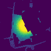

# ProMis - Probabilistic Mission Design

The goal of this repository is to provide an implementation and representation of inference on probabilistic logic programs that enables advanced, high level mission design.
Probabilistic Mission Design (ProMis) aims at giving high-level control over the navigation of vehicles, e.g., to effortlessly integrate local laws and regulations, by employing declarative, probabilistic modeling languages into the navigation process. 

## Installation

First, clone the repository to create a local workspace using `git clone git@github.com:HRI-EU/ProMis.git`.
It is recommandable to employ a `Python virtualenv` or similar in order to contain the installed packages in their own space:

```bash
python -m venv venv
source venv/bin/activate
```

Further, we need to install `Problog` with support for Distributional Clauses (DC) and Sentential Decision Diagrams (SDD).
To do so, run the following commands.

```bash
# Install separate pip dependencies
pip install pyro-ppl graphviz git+https://github.com/wannesm/PySDD.git#egg=PySDD

# Clone and install Problog with distributional clauses
# This contains bugfixes and features that are not part of the official release yet
cd ProMis/external
git clone https://github.com/simon-kohaut/problog.git
cd problog 
git checkout dcproblog_develop
pip install .
```

Finally, it is time to install `promis` as a Python package.

```bash
cd ProMis
pip install .
```

You can automate this process in a containerized environment using `Docker` and running the following instead.

```bash
cd ProMis
docker build . -t promis
docker run -it promis
```

## Usage

ProMis can be employed by first deciding the mission's setting and rules in the form of a Hybrid Probabilistic Logic Program.
Examples for this can be found in the `/models` folder.
Once the rules have been decided, the `ProMis` class can be used to generate a Probabilistic Mission Landscape (PML) in the relevant area.

```python
import matplotlib.pyplot as plt
from promis import ProMis
from promis.geo import LocationType, PolarLocation, CartesianLocation

# ProMis Parameters
dimensions = (1000.0, 1000.0)  # Meters
resolution = (100, 100)          # Pixels
spatial_samples = 50           # How many maps to generate to compute statistics
model = "Park"                 # Hybrid ProbLog to be used
types = [                      # Which types to load and compute relations for
    LocationType.PARK,
    LocationType.PRIMARY,
    LocationType.SECONDARY,
    LocationType.TERTIARY,
]  
tu_darmstadt = PolarLocation(latitude=49.878091, longitude=8.654052)

# Setup engine
pmd = ProMis(tu_darmstadt, dimensions, resolution, types, spatial_samples)

# Set parameters that are unrelated to the loaded map data
# Here, we imagine the operator to be situated at the center of the mission area
pmd.create_from_location(CartesianLocation(0.0, 0.0, location_type=LocationType.OPERATOR))

# Generate landscape
with open(f"../models/{model}.pl", "r") as model_file:
    landscape, time = pmd.generate(logic=model_file.read(), n_jobs=8)

# Show result
plt.imshow(landscape.data.T)
```



## Documentation

To build the documentation, ensure a full installation with the respective dependencies by running `pip install ".[doc]"`.
Then, using the following commands trigger Sphinx to create the documentation.

```bash
cd doc
make html
```

To view the documentation, open the file `ProMis/doc/build/html/index.html` with the browser of your choice.

## Quality Assurance

This projects is setup to be checked against `black` and `ruff`.
For ease of use, they can both be called by running `check.sh` in the ProMis root directory.
For tests with `pytest`, we employ `Hypothesis` to enhance coverage.
