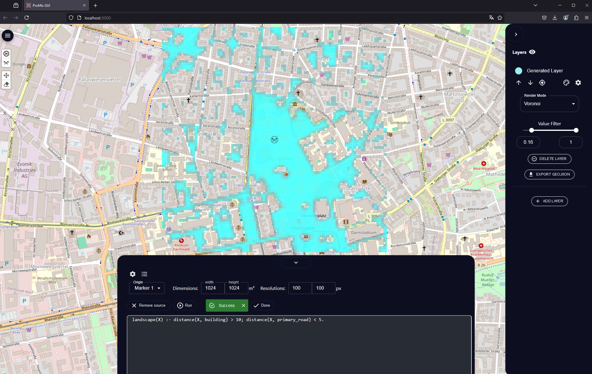

Graphical User Interface
========================

ProMis comes with a GUI that provides an interactive interface to its features.
To employ the GUI, make sure that you have installed ProMis according to the instructions above.
Then, first run the following commands to start the gui.

.. code-block:: bash
    :linenos:

    promis_gui

You can now open `http://localhost:8000/gui <http://localhost:8000/gui>`_ in a browser of your choice to start interacting with ProMis.

Once you have opened the GUI in your browser, you can check that everything works by doing an example run.
First, from the top-left, click the drone icon and place a marker where you would like to center the mission area.
Second, click the button at the bottom to open the mission design interface.
Here, you can either import ProMis code from disk using the `Import Source` button, or type the code in the code editor.
You may further configure your run by selecting an origin, height, width (in meters) and a resolution of the mission landscape. 
Afterwards, you can click the `Run` button and wait for the mission landscape to show on the map.

The following shows an example of entering the simple model `landscape(X) :- distance(X, building) > 10; distance(X, primary_road) < 5.`:

For more detailed information, consult the GUI's own `README <https://github.com/HRI-EU/ProMis/blob/main/gui/README.md>`_.
