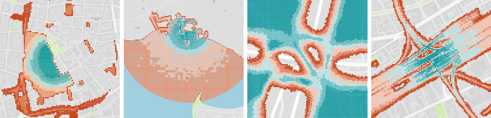

ProMis - Probabilistic Mission Design
=====================================

ProMis (Probabilistic Mission Design) is a framework for designing and executing missions for autonomous agents, like drones, while adhering to a set of rules and constraints. 
It uses probabilistic first-order logic to reason about uncertainties in the environment and the agent's state, ensuring that the agent acts in a principled and explainable manner.

The image below shows ProMis being applied in a diverse set of scenarios. 
High-probability areas (safe to fly) are shown in blue, low-probability areas are shown in red, and unsuitable spaces are transparent.

What is ProMis?
---------------

ProMis allows users to formalize their knowledge about local rules, such as traffic regulations, to constrain an agent's actions and motion. 
By employing a mathematical framework that combines formal reasoning with probabilistic inference, ProMis provides a weighted belief about whether the encoded rules are satisfied for any given state.

This paves the way towards **Constitutional Agents**; agents that can justify their actions and operate predictably even under uncertainty. 
ProMis offers high-level, adaptable control over the navigation process, making it easy to integrate local laws, operator requirements, and environmental uncertainties into logical and spatial constraints.

The output of ProMis is a set of scalar fields representing the probability of adhering to the agent's "constitution" across its state-space. 
These can be used for path planning, automated clearance granting, and optimizing mission parameters.

Key Features
------------

*   **Declarative Rule Engine:** Define complex rules and constraints using probabilistic first-order logic.
*   **Geospatial Reasoning:** Natively handles spatial data and relationships, including uncertainties.
*   **Constitutional Agents:** Build agents that adhere to and explain their behavior based on a defined constitution.
*   **Probabilistic Inference:** Quantify and reason about uncertainty in sensor data, environmental models, and agent state.
*   **Flexible & Extensible:** Easily integrate with existing navigation and control systems.
*   **Visualization:** Generate Probabilistic Mission Landscapes for intuitive mission analysis and planning.

Contents
--------

.. toctree::
   :maxdepth: 2

   installation
   notebooks/usage
   gui
   api
