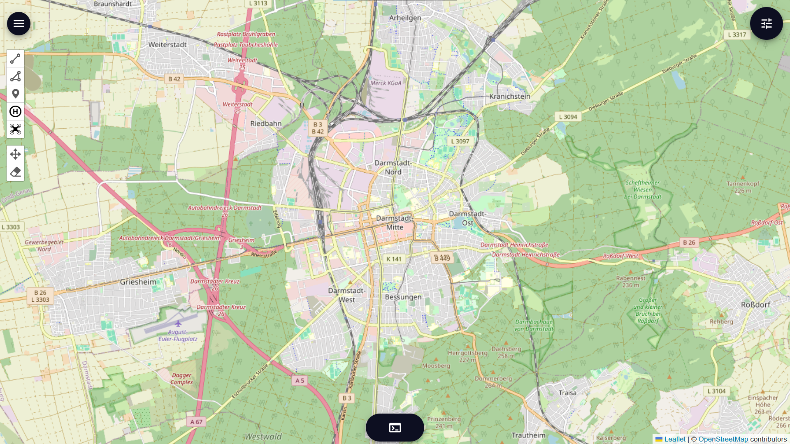
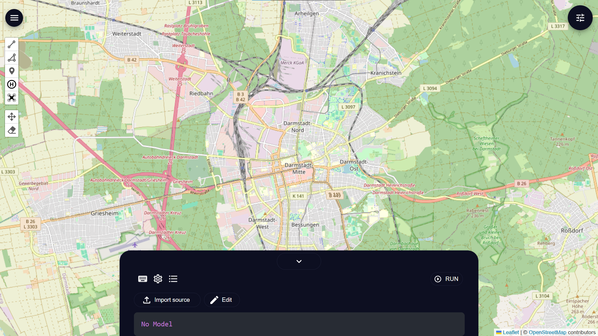
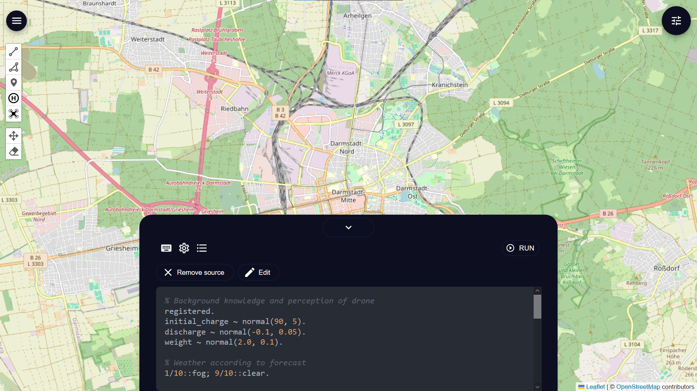
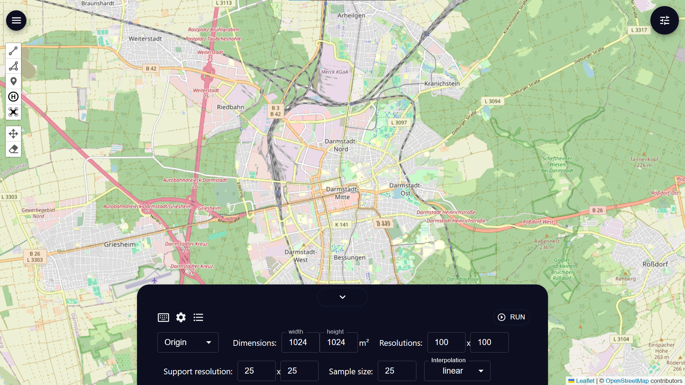
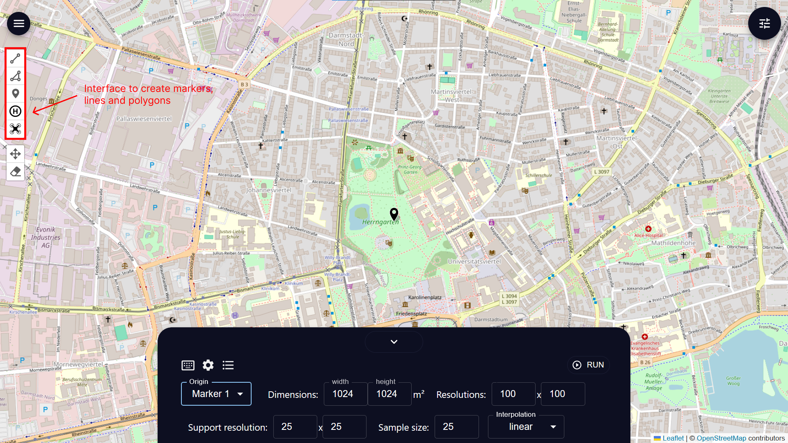
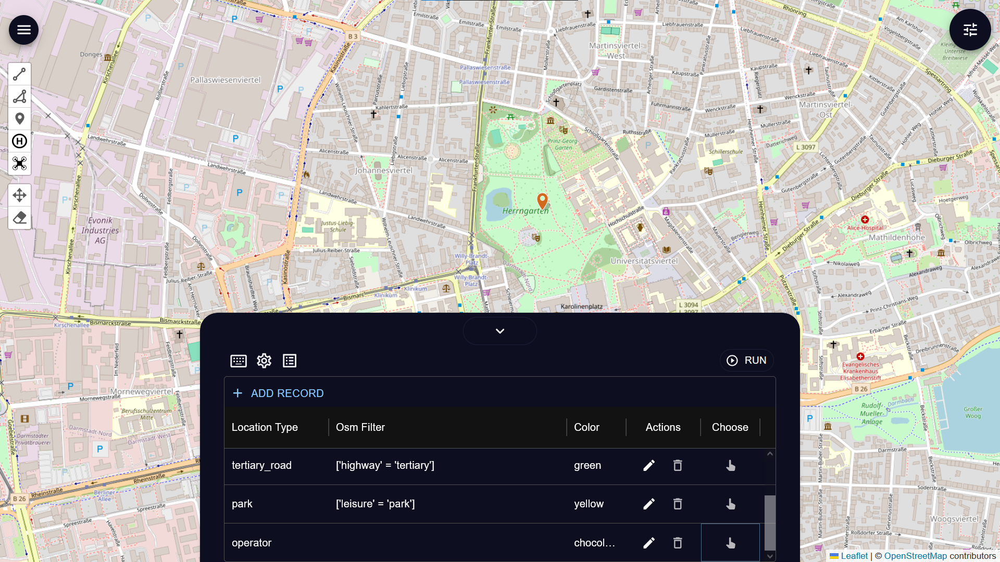
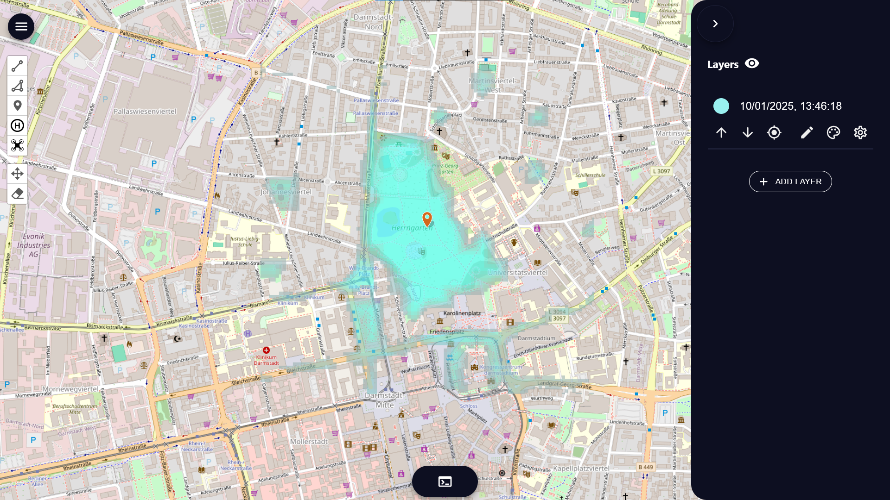

# ProMis GUI quick start guide
This is a step by step guide to help you understand the GUI basic. After reading you will be able to create your scenario and run the ProMis framework to map out probable space that could satisfy our rules. In this example we will recreate the scenario of landscape for drone navigation in a urban park from this paper ([Mission Design for Unmanned Aerial Vehicles using Hybrid Probabilistic Logic Programs](https://arxiv.org/abs/2406.03454)).

Starting up the gui you will see something like this:

<p align="center">
  
</p>

Then by interacting with the middle bottom button, it opened up the interface to define the scenario and rules.

<p align="center">
  
</p>

In this interface you can define the rules of the scenario either by importing a *.pl file using the import button or typing it in using the edit button. 

In this example, we'll just copy the rules from the paper. For more detail on how to define rules, you can check out [problog](https://dtai.cs.kuleuven.be/problog/). In all cases you must specify the rules for `landscape` which is define in this example as `landscape(X) :- permit(X), open(X), can_return(X).`

```prolog
% Background knowledge and perception of drone
registered.
initial_charge ~ normal(90, 5).
discharge ~ normal(-0.1, 0.05).
weight ~ normal(2.0, 0.1).

% Weather according to forecast
1/10::fog; 9/10::clear.

% Visual line of sight
vlos(X) :- fog, distance(X, operator) < 500;
    clear, distance(X, operator) < 750.

% Simplified OPEN flight category
open(X) :- registered, vlos(X), weight < 25.

% Charge to return to the operator
can_return(X) :- B is initial_charge,
    O is discharge,
    D is distance(X, operator),
    0 < B + (2 * O * D).

% Permit to fly in parks and close to major roads
permit(X) :- over(X, park); 
    distance(X, primary_road) < 15;
    distance(X, secondary_road) < 10;
    distance(X, tertiary_road) < 5.

% The Probabilistic Mission Landscape
landscape(X) :- permit(X), open(X), can_return(X).
```

Once you type all that in you'll have something like this:

<p align="center">
  
</p>

After this you can go to the main settings of the scenario by clicking the gear icon. Which you can then specify these following:

- origin: the origin of your scenario
- dimensions: the width and height of the origin which covers the scenario
- resolutions: specify how fine grain the final calculation will be

There are also support resolution, sample size and interpolation method which you can specify but is not important in this guide. You can find more about it in this paper ([StaR Maps: Unveiling Uncertainty in Geospatial Relations](https://arxiv.org/abs/2412.18356))

<p align="center">
  
</p>

To specify an origin we must create a marker on our map first. To do that click on any of the marker on the left and place a marker. After that you can choose the created marker as an origin by choosing it in the main settings in the bottom. For the other settings you can change to experiment with it if you want, but for now let stick to the default.

<p align="center">
  
</p>

The next thing you need to specify is the geographical entities of your scenario. Switching to the location type settings by clicking on the bulleted list icon next to the gear icon, you'll see a table of entries for `location type`, `Osm filter`,...

There are 2 ways to specify geographical entities, by loading it from openstreetmap or by choosing the lines, polygons and marker manually created from the left interface. You can load the entities from openstreetmap by specify the openstreetmap filter in the table. Choosing the entities in done by clicking the point icon in the location type you want to link it to and then click on the appropriate lines, polygons and markers that you want.

For our example we use the location type `primary_road`, `secondary_road`, `tertinary_road` and `park` that is defined by default with the openstreetmap filter `['highway' = 'primary']`, `['highway' = 'secondary']`, `['highway' = 'tertiary']` and `['leisure' = 'park']` correspondingly. To finish our example we also need to specify the operator by adding a record in our table with location type of `operator` and choose a marker for it. We'll choose the origin marker as our operator and after clicking the marker, you should see its color change to the color set in our operator entry. Make sure to click the x button after you done with choosing the marker.

After doing all the step you should have something like this:

<p align="center">
  
</p>

You can now click run to run the scenario (make sure you have the backend running beforehand). After running the framework you should see a new layer indicate the region that could satisfy the rules.

<p align="center">
  
</p>

Now you've learned the basic of the gui and can start creating your own scenario straight away!


